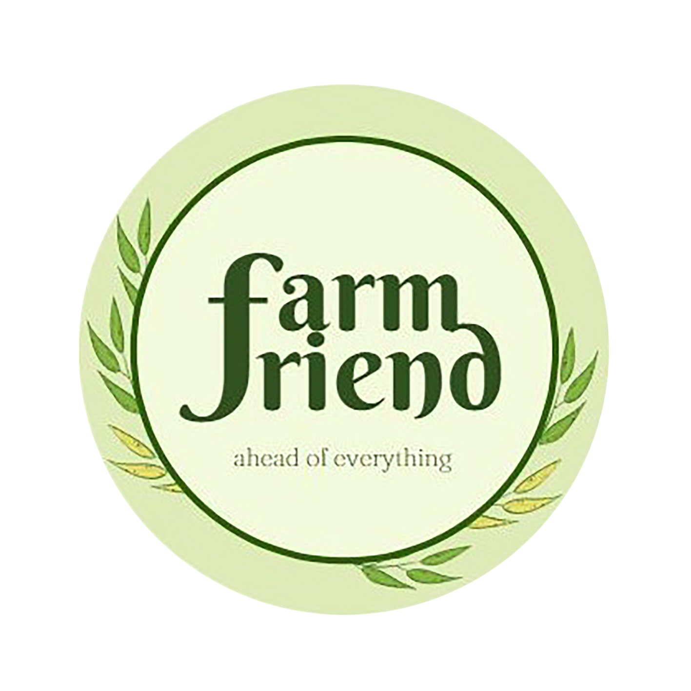

<p align="center">
  
  <h1 align="center">Farmfriend</h1>
  <p align="center">Growing Stronger Together: Supporting Agriculture for a Sustainable Future.</p>
</p>

## Description

A research project that applies weather support to farming. Verify the temperature, available crops to plant in the allocated area, and the present weather.

## Getting Started

### Dependencies

#### Front-End
* React Native
* Zustand
* Tanstack React-Query
* TWRNC (Tailwind React Native Classnames)
* Notifee (Push Notification)
* React Native Geolocation Service

#### Back-End
* ExpressJS
* Prisma
* MySQL
* PlanetScale
* Render

### Installing
```
yarn
```

### Executing program (Run Metro)
```
yarn start
```
### Executing program (Run Android)
```
yarn android
```
### Other Apps
* Farmfriend Web - [https://github.com/VeoScript/farmfriend-web](https://github.com/VeoScript/farmfriend-web)
* Farmfriend API - [https://github.com/VeoScript/farmfriend-api](https://github.com/VeoScript/farmfriend-api)


## Authors/Contributors

- Gayle Dela Torre - [@gaylemarie.delatorre](https://www.facebook.com/gaylemarie.delatorre)
- Joyce Mae Catubig - [@joycemae.catubiggabucan](https://www.facebook.com/joycemae.catubiggabucan)
- Jerome Villaruel - [@VeoScript](https://www.jeromevillaruel.cf/)
- Joshua Galit - [@jsvelte](https://www.joshuagalit.com/)

> Production Ready
